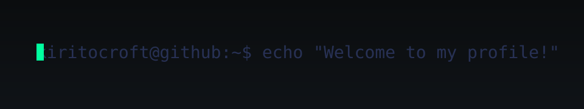
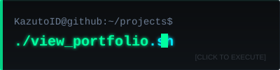
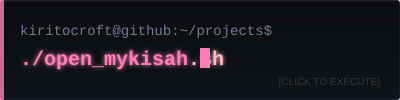
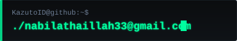
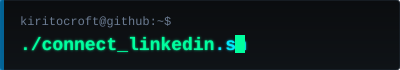
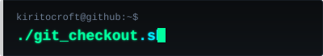

<div align="center">

<!-- Animated Hacker Banner -->


<br/>

```
┌──────────────────────────────────────────────────────────┐
│ kiritocroft@github:~$ whoami                             │
└──────────────────────────────────────────────────────────┘
Nabil Athaillah — Full‑Stack Developer (Indonesia)

> Focus: Next.js, React, Node.js, TypeScript, Python
> Interests:  Web architecture, performance optimization, scalable systems, maintainable code
```

<br/>

<!-- Profile Views -->


</div>

---

## 🛠️ Toolbox

<div align="center">


</div>

---

## 📊 GitHub Stats

<div align="center">


</div>

<div align="center">

| **🏆 Commit Streak** | **💻 Top Languages** |
| :---: | :---: |
|  |  |

</div>

---

## 🚀 Projects

<p align="left">
  <a href="https://github.com/Kiritocroft/Kazuto-Portofolio">
    
  </a>
  <br/>
  <a href="https://github.com/Kiritocroft/MyKisah">
    
  </a>
</p>

---

## 🐍 Contribution Snake

<div align="center">
  
  <br/>
  <em>Generated by GitHub Actions — updated daily.</em>
</div>

---

## 📬 Contact

<p align="left">
  <a href="mailto:nabilathaillah33@gmail.com">
    
  </a>
  <br/>
  <a href="https://linkedin.com/in/nabil-athaillah">
    
  </a>
  <br/>
  <a href="https://github.com/kiritocroft">
    
  </a>
</p>

---

<div align="center">

```
> echo "Thanks for stopping by!"
Thanks for stopping by!
```

</div>
